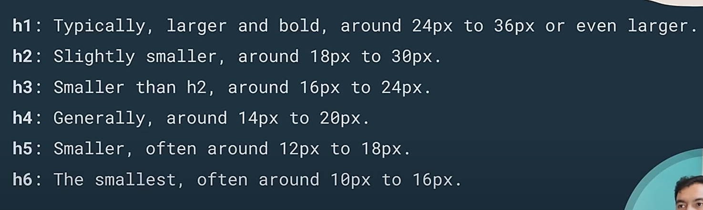

# HTML (Hyper Text Markup Language):

- `Hyper Text` : Hyper Text is a text which contains `links` to other texts.
- `Markup Language` : This is a language in which instructions are given to a computer about how content should be organized and displayed.
- `History of HTML` :
  - `HTML 1` : In 1980s,
  - `HTML 4` : significant improvements likes better support for `forms`, `scripts` and `style-sheets`.
  - `HTML 5` : took a major milestone, with a focus on multimedia, improved `semantics`, better support for web applications with `<video>`, `<audio>`, `<picture>`.

[]
